# Documentation for Project 3 -- SIMPLE TO-DO APPLICATION ON MERN WEB STACK

## STEP - 1 BACKEND CONFIGURATION `
 
* Update and upgrade ubuntu EC2 instance `

` sudo apt update  && sudo apt upgrade -y ` 

* locate the Node.js software from Ubuntu repositories. `

` curl -fsSL https://deb.nodesource.com/setup_18.x | sudo -E bash - `

*  Install Node.js on the server `

` sudo apt-get install -y nodejs `

* Note: The command above installs both nodejs and npm.` 

` node -v  && npm -v are used to verify the installation versions above `

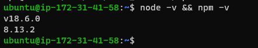

* Application Code Setup 

* Create a new directory for your To-Do project and  cd into it `

` mkdir Todo && cd Todo `

*  use  npm init to initialise your project, so that a new file named package.json will be created.  Follow the prompts and press Enter several times to accept default values, then accept to write out the package.json file by typing yes. 

` npm init ` 

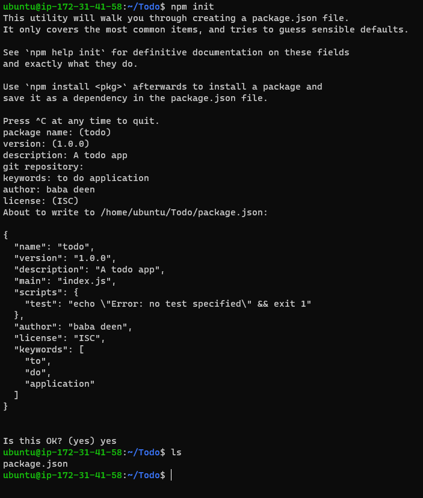

* installing EXPRESSJS `

` npm install express `

*  create a file index.js ` 

` touch index.js && ls `

* Install the dotenv module `

` npm install dotenv `

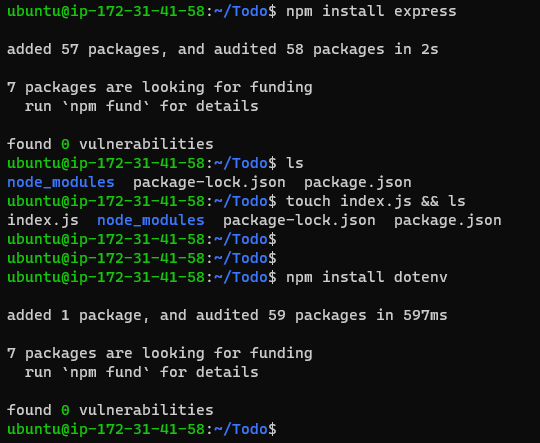

* Open the index.js ` 

` vi index.js `

* Type the code below into it and save. ` 

` const express = require('express');
require('dotenv').config();

const app = express();

const port = process.env.PORT || 5000;

app.use((req, res, next) => {
res.header("Access-Control-Allow-Origin", "\*");
res.header("Access-Control-Allow-Headers", "Origin, X-Requested-With, Content-Type, Accept");
next();
});

app.use((req, res, next) => {
res.send('Welcome to Express');
});

app.listen(port, () => {
console.log(`Server running on port ${port}`)
}); `

` # to test the server run below command ` 

` node index.js ` 

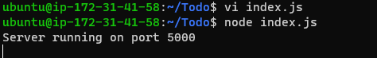

` #  you need to open port 5000 on EC2 instance `

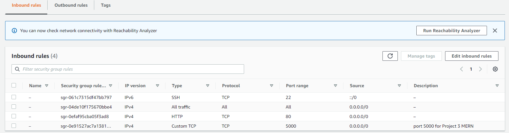

` http://<PublicIP-or-PublicDNS>:5000 `

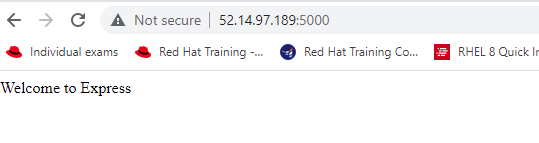

` creating Routes for todo application so that it do the below tasks `

* to create a new task 
* to display list of all tasks and
* to delete a completed tasks

` mkdir routes && cd routes && touch api.js && vi api.js 

*  copy the below into the api.js file 

` const express = require ('express');
const router = express.Router();

router.get('/todos', (req, res, next) => {

});

router.post('/todos', (req, res, next) => {

});

router.delete('/todos/:id', (req, res, next) => {

})

module.exports = router; `

* creating schemma and models ---- lets install mongoose, mkdir models folder under Todo dir, cd into it and tocuh a file called todo.js`

` npm install mongoose `

` mkdir models && cd models && touch todo.js `

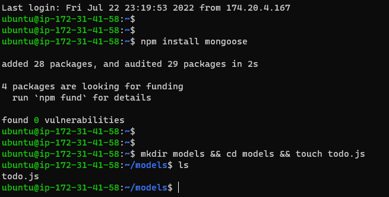

*  under routes dir, edit api.js file and delete all the content and paste the below 

` const express = require ('express');
const router = express.Router();
const Todo = require('../models/todo');

router.get('/todos', (req, res, next) => {

//this will return all the data, exposing only the id and action field to the client
Todo.find({}, 'action')
.then(data => res.json(data))
.catch(next)
});

router.post('/todos', (req, res, next) => {
if(req.body.action){
Todo.create(req.body)
.then(data => res.json(data))
.catch(next)
}else {
res.json({
error: "The input field is empty"
})
}
});

router.delete('/todos/:id', (req, res, next) => {
Todo.findOneAndDelete({"_id": req.params.id})
.then(data => res.json(data))
.catch(next)
})

module.exports = router; ` 

` vi api.js  save and exit` 

* creating MongoDB Database using mLab as DBaaS`

* starting my server 

` node index.js ` 

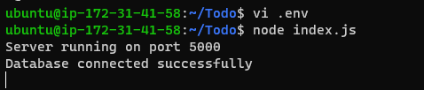

* Testing Backend Code without Frontend using RESTful API 

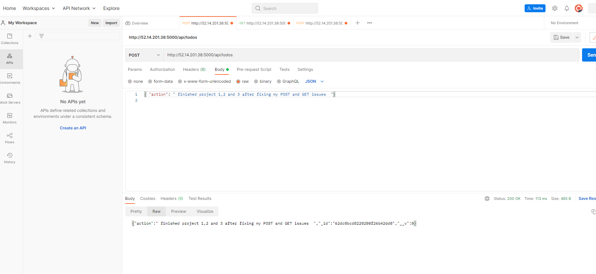

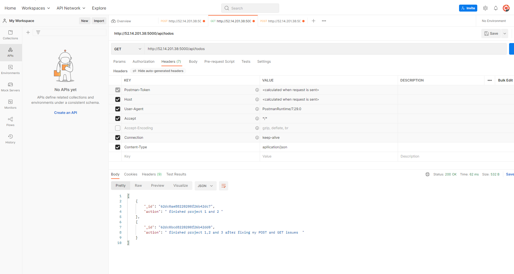

##  Step 2 -- FRONTEND CREATION 

* run below at the /Todo dir `

`  npx create-react-app client `

* install concurrently and nodemon `

` npm install concurrently --save-dev  and npm install nodemon --save-dev `
*  in Todo dir update with below and delete the line starting with "script "  see image below 

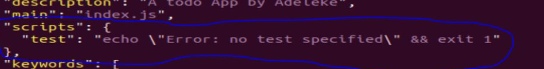

` "scripts": {
"start": "node index.js",
"start-watch": "nodemon index.js",
"dev": "concurrently \"npm run start-watch\" \"cd client && npm start\""
}, `

* configure proxy in package.json, cd into client, edit package.json and add "proxy": "http://localhost:5000"  and run below command in Todo dir `

` npm run dev ` 

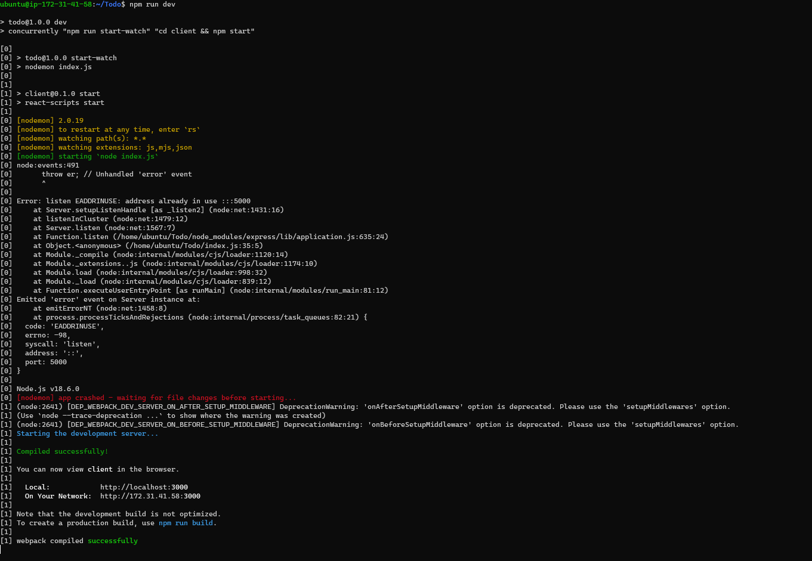

* opened port 3000 on my EC2 `

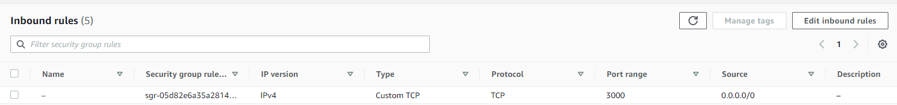

*  Creating your React Components from Tod dir ` 

` cd client && cd src && mkdir components && cd components && touch Input.js ListTodo.js Todo.js && vi input.js `

*  install axios in clients dir and  cd src/components and edit ListTodo.js`

` npm install axios ` 

` cd src/components ` 

` vi ListTodo.js  and paste the below  ` 

`  import React from 'react';

const ListTodo = ({ todos, deleteTodo }) => {

return (
<ul>
{
todos &&
todos.length > 0 ?
(
todos.map(todo => {
return (
<li key={todo._id} onClick={() => deleteTodo(todo._id)}>{todo.action}</li>
)
})
)
:
(
<li>No todo(s) left</li>
)
}
</ul>
)
}

export default ListTodo `

` vi Todo.js and paste the below `

` import React, {Component} from 'react';
import axios from 'axios';

import Input from './Input';
import ListTodo from './ListTodo';

class Todo extends Component {

state = {
todos: []
}

componentDidMount(){
this.getTodos();
}

getTodos = () => {
axios.get('/api/todos')
.then(res => {
if(res.data){
this.setState({
todos: res.data
})
}
})
.catch(err => console.log(err))
}

deleteTodo = (id) => {

    axios.delete(`/api/todos/${id}`)
      .then(res => {
        if(res.data){
          this.getTodos()
        }
      })
      .catch(err => console.log(err))

}

render() {
let { todos } = this.state;

    return(
      

        <h1>My Todo(s)</h1>
        <Input getTodos={this.getTodos}/>
        <ListTodo todos={todos} deleteTodo={this.deleteTodo}/>
      

    )

}
}

export default Todo; `

* cd back to src dir and vi App.js paste the below 

` cd /src && vi App.js

` import React from 'react';

import Todo from './components/Todo';
import './App.css';

const App = () => {
return (

<Todo />

);
}

export default App; `

` vi App.css  and paste the below `

` .App {
text-align: center;
font-size: calc(10px + 2vmin);
width: 60%;
margin-left: auto;
margin-right: auto;
}

input {
height: 40px;
width: 50%;
border: none;
border-bottom: 2px #101113 solid;
background: none;
font-size: 1.5rem;
color: #787a80;
}

input:focus {
outline: none;
}

button {
width: 25%;
height: 45px;
border: none;
margin-left: 10px;
font-size: 25px;
background: #101113;
border-radius: 5px;
color: #787a80;
cursor: pointer;
}

button:focus {
outline: none;
}

ul {
list-style: none;
text-align: left;
padding: 15px;
background: #171a1f;
border-radius: 5px;
}

li {
padding: 15px;
font-size: 1.5rem;
margin-bottom: 15px;
background: #282c34;
border-radius: 5px;
overflow-wrap: break-word;
cursor: pointer;
}

@media only screen and (min-width: 300px) {
.App {
width: 80%;
}

input {
width: 100%
}

button {
width: 100%;
margin-top: 15px;
margin-left: 0;
}
}

@media only screen and (min-width: 640px) {
.App {
width: 60%;
}

input {
width: 50%;
}

button {
width: 30%;
margin-left: 10px;
margin-top: 0;
}
} ` 

` vi index.css and paste the below ` 

` body {
margin: 0;
padding: 0;
font-family: -apple-system, BlinkMacSystemFont, "Segoe UI", "Roboto", "Oxygen",
"Ubuntu", "Cantarell", "Fira Sans", "Droid Sans", "Helvetica Neue",
sans-serif;
-webkit-font-smoothing: antialiased;
-moz-osx-font-smoothing: grayscale;
box-sizing: border-box;
background-color: #282c34;
color: #787a80;
}

code {
font-family: source-code-pro, Menlo, Monaco, Consolas, "Courier New",
monospace;
} `

` cd  in Todo dir and run npm run dev  `

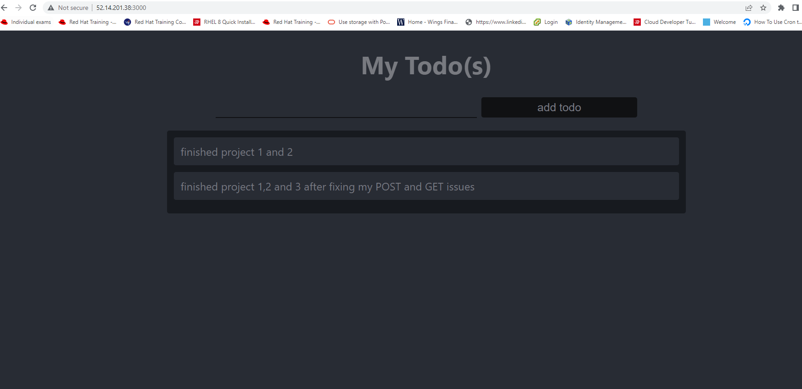

